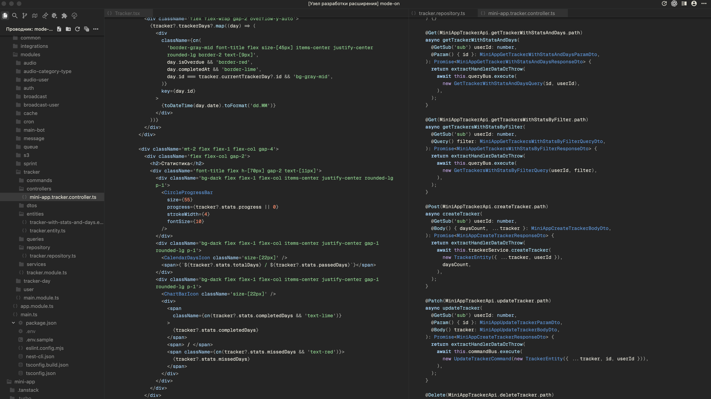

# Calm Code

Calm Code is a quiet, dark VS Code theme focused on low visual noise and high readability. Operators and punctuation are neutral gray, types are a soft blue, and errors are clear without being harsh.

## Why Try It?

- Dark theme with semantic highlighting for token-aware clarity.
- Subdued operators and punctuation keep focus on names and logic.
- Clear diagnostics levels make issues easy to scan at a glance.
- Consistent token treatment across languages simplifies context switching.
- Calm bracket guides and matching make nested code easier to follow.
- Readable diff and merge styling highlights changes without distraction.
- Git gutter decorations surface added/modified/deleted lines while coding.
- Cohesive UI colors align panels, tabs, and side bar with the editor.
- Terminal support includes an ANSI palette for an integrated look.
